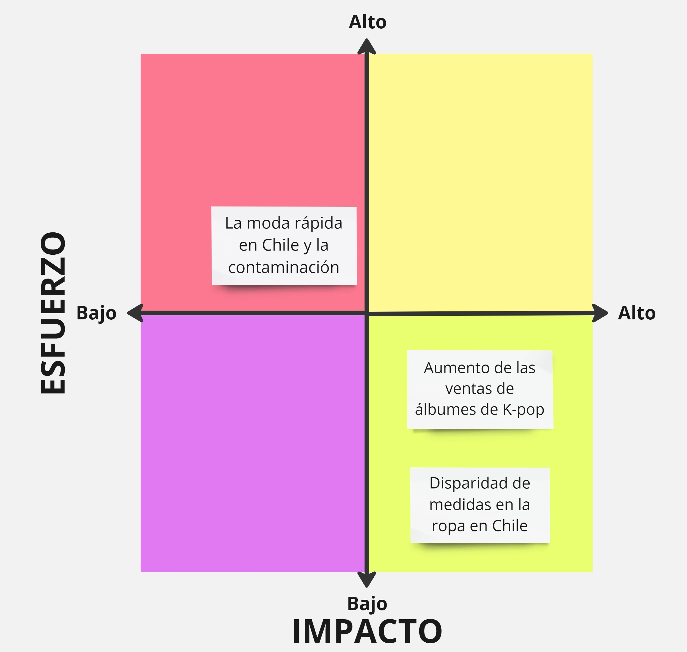

# Tarea 01

En esta tarea se expondrán las conclusiones de la primera actividad donde se realizó una lluvia de ideas sobre posibles temas para trabajar. Además, se expondrán sus ventajas y desventajas.

- **El aumento de las ventas de álbumes de K-pop**: En los últimos años las ventas físicas de los grupos coreanos han crecido tanto que se han llegado a vender millones de copias, por lo que se podría revisar el posible daño que han llegado a tener en el medioambiente en el último tiempo. Tiene la ventaja de que los datos totales de álbumes vendidos son fácilmente conseguibles al ser recopilados por una plataforma coreana llamada *Circle Chart* y actualmente es sumamente importante tratar temas que aporten a cuidar nuestro medioambiente. Sin embargo, se deberían hacer algunos cálculos para ello considerando el peso de plásticos y objetos.

- **La diferencia en las tallas de ropa**: Al comprar en tiendas distintas o domprar marcas diferentes en un mismo comercio puede pasar que haya una disparidad de medidas, aunque estén catalogadas como si fueran iguales. Se podría analizar qué tan común es esto y, sobre todo, cómo se han sentido las personas ante esta situación. Tiene la ventaja de que se pueden conseguir fácilmente datos del SERNAC para revisar y es un tema relevante que no ha sido tan analizado.

- **El fast fashion en Chile y la contaminación**: Durante los últimos años la moda rápida ha permanecido fuertemente tanto en el mundo como en Chile, por lo que se podría revisar qué tanto impacto ha tenido en la contaminación del país y en la basura acumulada en vertederos. En un aspecto positivo, hay datos del Ministerio del Medioambiente de cuánto se compra en Chile y cómo ha aumentado. Sin embargo, tiene la desventaja de que habrá que ver una forma de calcular cómo esto se transforma en contaminación y, sobre todo, es un tema bastante analizado.

## Conclusiones

Al analizar las ideas, nos podemos dar cuenta que todas tienen datos existentes y conseguibles que poder revisar. Sin embargo, algunas requieren un mayor esfuerzo haciendo cálculos como es el caso de la venta de álbumes de K-pop y el fast fashion. En particular, en la moda rápida habría que trabajar más al buscar un modo de hacer la transformación de compras a contaminación, mientras que en la venta de discos coreanos se podría hacer simplemente transformando la cantidad de álbumes en el plástico. Además, hay algunos que han sido menos tratados en el país como la venta de mercancía de K-pop y la diferencia de medidas en la ropa. En conclusión, considerando el esfuerzo y el impacto que tendrían, se podrían ordenar e ilustrar de la siguiente manera:

1. La diferencia en las tallas de ropa

1. La venta de álbumes de K-pop

1. El fast fashion en Chile y la contaminación

[Ir a miro](https://miro.com/app/board/uXjVKeaUNP4=/?share_link_id=528915047417)